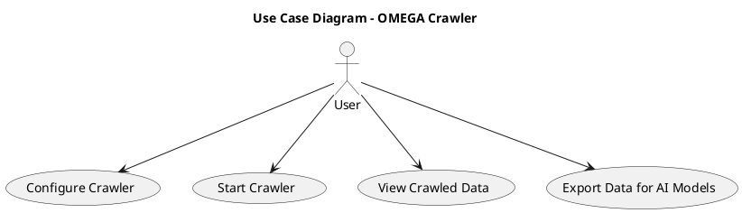
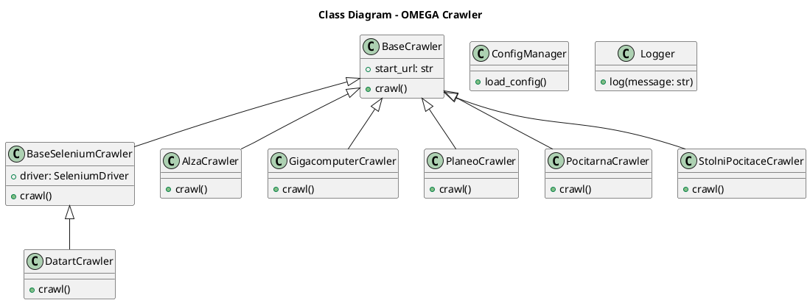
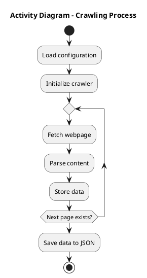

# Project Documentation: OMEGA

**Author:** Martin Říha  
**Contact:** [riha@spsejecna.cz](mailto:riha@spsejecna.cz) | [GitHub Profile](https://github.com/LopassMopass)  
**Date:** 06.04.2025  
**School:** SPŠE Ječná  
**Type:** School Project

## Project Overview
The OMEGA project focuses on web crawling to collect data from various e-commerce websites. This data is then prepared and exported for use in predictive AI modeling, such as linear regression, random forest, and neural networks. The main goal is to demonstrate the predictive capabilities of machine learning models using real-world data collected via automated web crawling.

## User Requirements
- Easy configuration and management of web crawlers.
- Ability to initiate crawling operations.
- Accessible and structured viewing of collected data.
- Exporting crawled data for further processing by AI models.

### UML Use Case Diagram


## Application Architecture
The application utilizes a modular crawler structure allowing easy addition of new sources and configurations. Crawlers inherit from base classes designed to handle generic crawling activities.

### UML Class Diagram


### UML Activity Diagram


## Database (File-based JSON)
The project uses JSON files to store the crawled data. These JSON files include structured data ready for import into machine learning environments.

## Configuration
Crawler configurations can be adjusted in:
- **crawler/config/config.json**:
  - `name`: Crawler name.
  - `start_url`: Initial URL for crawling.
  - `agent`: Browser user-agent.
  - `batch_size`: Number of pages or items per crawling session.

## Installation & Execution
### Installation
1. Clone repository.
2. Install dependencies:
```bash
pip install beautifulsoup4 selenium tkinter pandas numpy
```

### Execution
Run the crawler:
```bash
python crawler/src/main.py
```

Start GUI:
```bash
python gui/src/app.py
```

## Error Handling
- **Crawler errors:** Typically involve connection issues, incorrect parsing, or structural changes in target websites.
- **Import errors:** Issues may occur from missing files or incorrect path definitions. Check file existence and correct paths in configurations.

## Third-party Libraries
- `beautifulsoup4`: HTML parsing.
- `selenium`: Web interaction and JavaScript execution.
- `tkinter`: Graphical user interface.
- `pickle`: Serialization of models.
- `pandas`: Data manipulation.
- `numpy`: Numeric computations.

## My past code
- **Project_Beta**: Base Crawlers, Dictionary, Config

## Design and architectural patterns
- **Template Method Pattern for Crawlers**: Used in `base_crawler.py` 
- **Singleton Pattern for Configuration Management**: Used in `config_manager.py`

## What was my inspiration/helper
- `ChatGPT`: Documentation - [Chat](https://chatgpt.com/g/g-p-6796534fbf108191811f52a63eb58b20-pv/c/67f2e378-9028-800e-a475-4fce81627f1e)
- `Pandas`: A little bid of a documentation
- `Python`: Again, Python documentation helped me in some cases
- `Stack Overflow`: Help from strangers is always the best
- `Teachers`: A lot of ideas or even code was supplied by my teachers

## Final Summary
The OMEGA project successfully demonstrates the practical use of automated crawlers and predictive modeling. By providing structured, easily-configurable crawling tools, it enables efficient data collection suitable for various machine learning applications.

